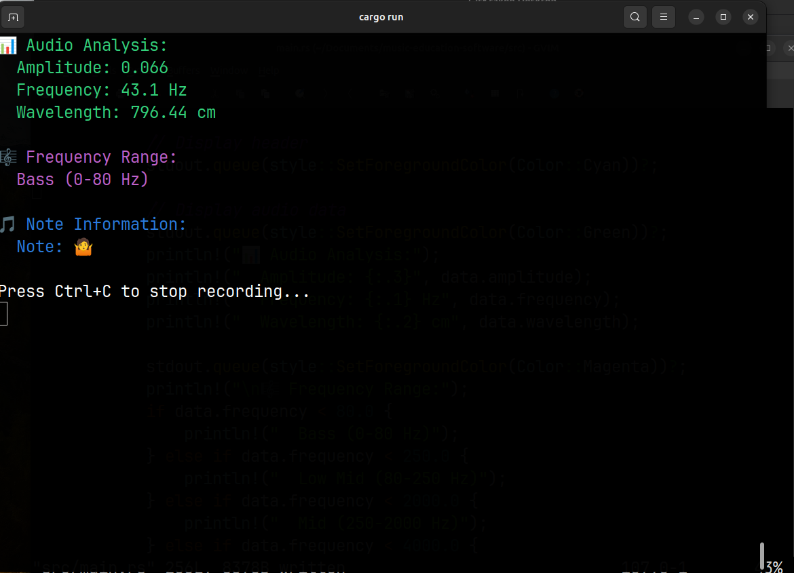

# Music Learner's Server

A simple Rust server for real-time audio analysis that can be used by frontend applications (iOS, Android, WebAssembly).

## Features

- Real-time microphone input capture
- Audio analysis (amplitude, frequency, wavelength)
- Terminal-based live display
- Cross-platform audio support

## Prerequisites

### Linux
Install ALSA development libraries and pkg-config:
```bash
# Ubuntu/Debian
sudo apt install libasound2-dev pkg-config

# CentOS/RHEL/Fedora
sudo yum install alsa-lib-devel pkgconfig
# or for newer versions:
sudo dnf install alsa-lib-devel pkgconfig

# Arch Linux
sudo pacman -S alsa-lib pkgconf
```

**What these packages do:**
- `libasound2-dev` (or `alsa-lib-devel`): Provides ALSA (Advanced Linux Sound Architecture) development headers and libraries needed for audio input/output
- `pkg-config`: Helps the build system find and link against the ALSA libraries

### macOS
**Coming soon** - Real audio support will be added in a future update.

### Windows
**Coming soon** - Real audio support will be added in a future update.

## Building and Running

### Demo Mode (No Audio Libraries Required)
```bash
cargo build
cargo run
```

### Real Audio Mode (Requires ALSA Libraries)
First install the required audio libraries:
```bash
# Ubuntu/Debian
sudo apt install libasound2-dev pkg-config

# Then uncomment the cpal dependency in Cargo.toml and rebuild
cargo build --release
cargo run --release
```

## Usage

1. Run the program
2. Select your microphone from the device list
3. The program will display real-time audio analysis:
   - Amplitude (volume level)
   - Frequency (pitch in Hz)
   - Wavelength (in cm)
   - Visual amplitude bar
   - Frequency range classification

Press Ctrl+C to stop recording.

## Audio Analysis

The server performs real-time analysis including:
- **Amplitude**: RMS (Root Mean Square) calculation for volume
- **Frequency**: FFT-based pitch detection
- **Wavelength**: Calculated from frequency using speed of sound (343 m/s)

⚠️ **Note Detection Work in Progress**: The note detection feature is currently under development. Data may be inaccurate and should not be relied upon for precise musical analysis.

## Screenshot



## Future Frontend Integration

This server is designed to be extended for frontend applications:
- REST API endpoints for audio data
- WebSocket streaming for real-time data
- JSON data format for easy consumption
- CORS support for web applications
